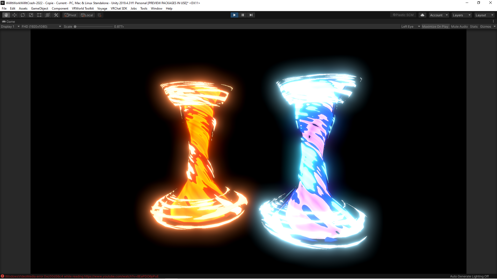
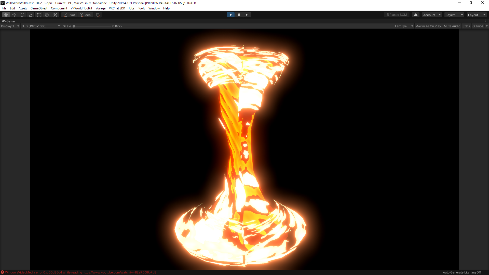

# A simple Tornado effect

The creation process was basically :

* Recreate Gabriel Aguilar's ["Fire Tornado Effect"](https://www.youtube.com/watch?v=gLWe_Wzc8Xc) using ShaderGraph in a Unity 2019 URP
* Port the create shader to Unity Builtin, using ShaderGraph documentation to get most of the codes nodes.

This tornado effect is pretty cool, uses only simple noise functions
and arithmetics.

The original video uses 3 particle emitters to generate the effect.  
Here, the shader just apply 3 passes with different scaling.  
Note that, due to that scaling, the effect cannot be used on a Particle Emitter.

 however it has one glaring issue : The generated noise
doesn't tile.  
So you can see a big seam at some location of the tornado.

